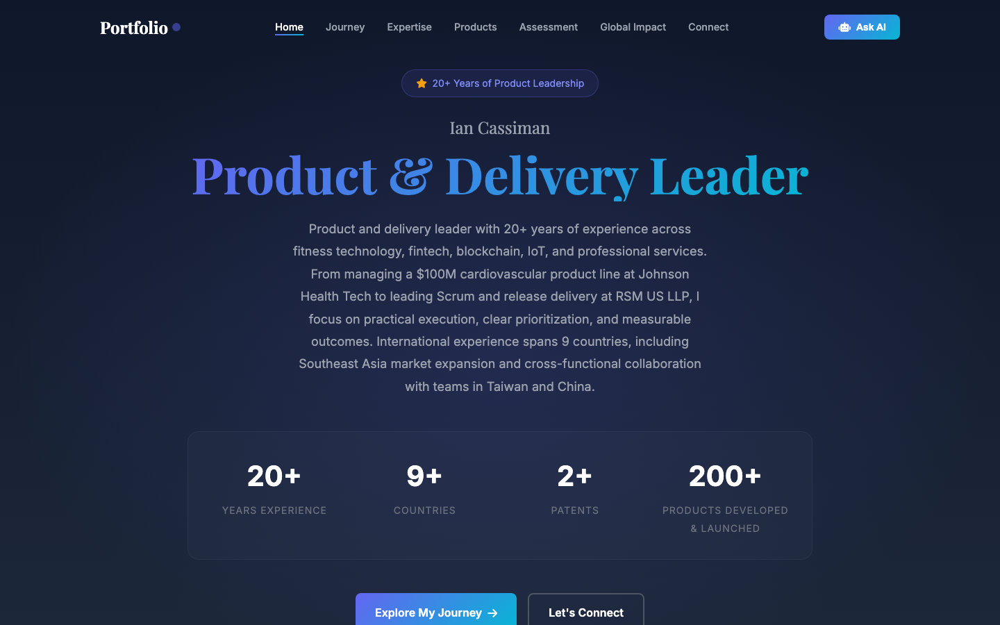

# 🚀 Professional Portfolio - 25+ Years of Global Tech Leadership

An interactive, visually stunning portfolio website showcasing a distinguished career spanning over two decades in technology leadership, AI/ML innovation, and enterprise architecture.



## ✨ Features

### Visual Experience
- **Particle Animation Background** - Interactive particle network that responds to mouse movement
- **GSAP Scroll Animations** - Smooth, performant scroll-triggered animations throughout
- **3D Interactive Elements** - Globe visualization and card hover effects
- **Responsive Design** - Optimized for all devices from mobile to desktop
- **Dark Modern Theme** - Professional aesthetic with elegant gradient accents

### Content Sections
- **Hero** - Dynamic intro with animated stats and call-to-action
- **Career Timeline** - Interactive chronological journey through 25+ years
- **Expertise** - Skill visualization with animated progress bars
- **Products** - Showcase of flagship products and their impact
- **Global Map** - Visual representation of worldwide experience
- **Tech Stack** - Animated technology universe
- **Contact** - Professional contact form and social links

### AI Integration
- **Career Assistant Chatbot** - AI-powered Q&A about experience and fit
- **Ready for Azure OpenAI** - Prepared architecture for LLM integration
- **Interactive Queries** - Users can ask about skills, experience, and opportunities

## 🛠 Tech Stack

- **Frontend**: HTML5, CSS3 (Custom + Variables), Vanilla JavaScript
- **Animations**: GSAP (GreenSock), ScrollTrigger, Custom Particle System
- **Icons**: Font Awesome 6
- **Typography**: Inter + Playfair Display (Google Fonts)
- **Hosting**: Azure Static Web Apps
- **CI/CD**: GitHub Actions

## 🚀 Getting Started

### Prerequisites
- Node.js 18+ (for local development server)
- VS Code with recommended extensions
- Azure CLI (for deployment)

### Local Development

1. **Clone the repository**
   ```bash
   git clone https://github.com/amerikian/Personal-Website.git
   cd Personal-Website
   ```

2. **Install dependencies**
   ```bash
   npm install
   ```

3. **Start development server**
   ```bash
   npm run dev
   ```

4. **Open in browser**
   Navigate to `http://localhost:3000`

### VS Code Development
1. Open the folder in VS Code
2. Right-click `index.html` and select "Open with Live Server"
3. The page will auto-reload on changes

## 📁 Project Structure

```
Personal-Website/
├── index.html              # Main HTML file
├── css/
│   └── styles.css          # All styles with CSS variables
├── js/
│   ├── data.js             # Career data structure
│   ├── particles.js        # Particle background system
│   ├── animations.js       # GSAP scroll animations
│   └── main.js             # Core functionality & chat
├── scripts/
│   ├── visual-check.js      # One-off screenshot capture/validation
│   └── visual-regression.js # Baseline + diff visual regression
├── images/                  # Static assets (to be added)
├── api/                     # Azure Functions for AI (future)
├── staticwebapp.config.json # Azure SWA configuration
├── package.json            # Dependencies & scripts
└── README.md              # This file
```

## 🔧 Customization

### Updating Career Data
Edit `js/data.js` to update:
- Personal profile information
- Timeline entries
- Products and projects
- Global locations
- Skills and tech stack

### Styling
All styles use CSS variables in `css/styles.css`:
```css
:root {
    --primary: #6366f1;
    --secondary: #06b6d4;
    /* ... more variables */
}
```

### Adding New Sections
1. Add HTML section in `index.html`
2. Add styles in `css/styles.css`
3. Add animations in `js/animations.js`
4. Add navigation link in navbar

## ☁️ Deployment

### Azure Static Web Apps

1. **Install SWA CLI**
   ```bash
   npm install -g @azure/static-web-apps-cli
   ```

2. **Login to Azure**
   ```bash
   az login
   ```

3. **Deploy**
   ```bash
   swa deploy . --env production
   ```

### GitHub Actions (Automated)
Push to `main` branch triggers automatic deployment via the included workflow.

## 🤖 AI Assistant Integration

The portfolio includes a chat widget ready for AI integration. To connect to Azure OpenAI:

1. Create Azure OpenAI resource
2. Deploy a model (GPT-4 recommended)
3. Add Azure Function in `/api` folder
4. Update `generateAIResponse()` in `main.js`

See [Azure OpenAI Docs](https://learn.microsoft.com/azure/ai-services/openai/) for setup.

## 👀 Visual Regression (Playwright)

Automated screenshot validation is available for desktop and mobile views.

### Commands

```bash
# Capture regular screenshots
npm run visual:check

# Create/update baseline images
npm run visual:baseline

# Compare current UI to baseline
npm run visual:compare
```

### Commit-time validation

This repo uses a committed hook at `.githooks/pre-commit`.

```bash
# Run once per clone
npm run hooks:install
```

On each commit, the hook starts a local static server and runs visual compare.
Baselines are stored in `artifacts/visual-baseline/`.

## 📊 Research & Data Collection

To populate with actual career data:

1. **LinkedIn Import** - Use LinkedIn export feature for base data
2. **Manual Entry** - Update `js/data.js` with detailed information
3. **Company Research** - Add product details and impact metrics

## 🎨 Recommended VS Code Extensions

These extensions are already installed/configured:
- Live Server - Local development preview
- Tailwind CSS IntelliSense - CSS utilities (optional enhancement)
- Prettier - Code formatting
- Azure Static Web Apps - Deployment management

## 📈 Future Enhancements

- [ ] Connect AI chatbot to Azure OpenAI
- [ ] Add blog/articles section
- [ ] Implement recommendations engine
- [ ] Add analytics dashboard
- [ ] Create admin panel for content management
- [ ] Add multilingual support
- [ ] Implement dark/light theme toggle

## 📄 License

MIT License - See [LICENSE](LICENSE) for details

## 🤝 Contributing

This is a personal portfolio, but suggestions are welcome! Open an issue for:
- Bug reports
- Feature suggestions
- Design improvements

---

**Built with 💜 and AI assistance** | © 2026
